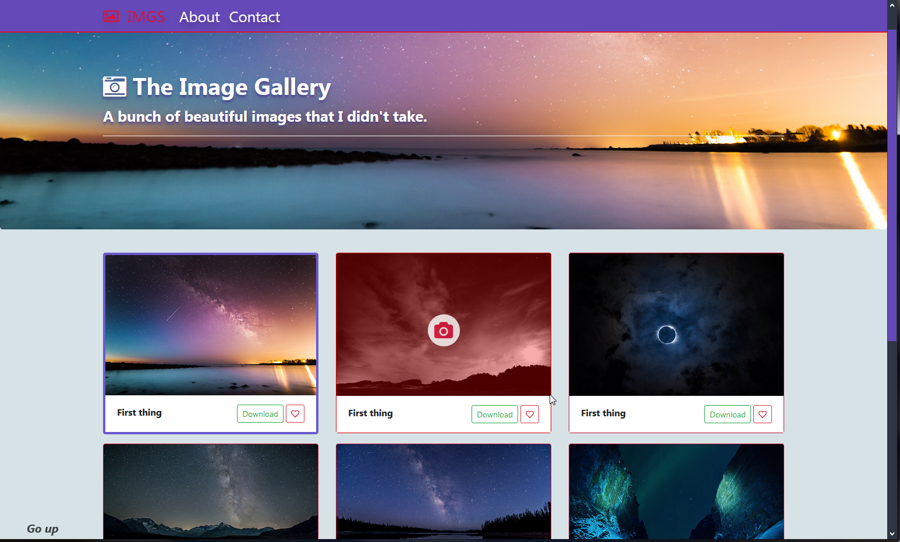

# [Langing-page__image-gallery](https://michal-w-dev.github.io/Langing-page__image-gallery/) 

 Html elements of image gallery created by javascript (grid based on css, cards based on bootstrap 4). 

<ul> Animations: 
  <li> on card hover and zooming out image (css) </li>
  <li> appearance of navbar at scrolling down (js) </li>
</ul>

 Extra features: custom scrollbar, selected image appear on background. 

 

